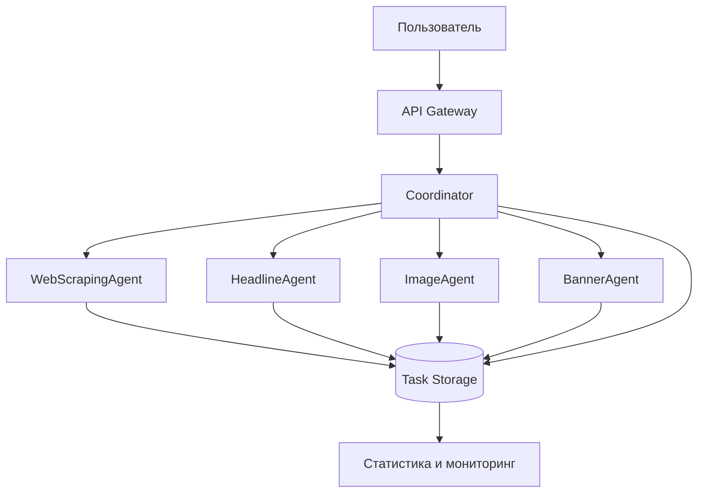

# 🤖 Мультиагентная система BannerAdsAI

## Обзор

Мультиагентная система BannerAdsAI представляет собой архитектуру, основанную на специализированных ИИ-агентах, каждый из которых отвечает за конкретную область обработки данных при создании рекламных баннеров.

## Архитектура системы



## Агенты системы

### 🕷️ WebScrapingAgent

**Назначение**: Анализ и извлечение контента веб-страниц

**Основные методы**:
```javascript
async analyzeUrl(url)
```

**Возможности**:
- Извлечение заголовков (title, h1-h6)
- Парсинг meta-описаний
- Определение основного контента
- Автоматическое определение языка (ru/en)
- Fallback механизм для недоступных страниц
- Обработка различных кодировок

**Примеры использования**:
```javascript
const webAgent = new WebScrapingAgent();
const content = await webAgent.analyzeUrl('https://example.com');
console.log(content.title); // "Example Domain"
console.log(content.detectedLanguage); // "en"
```

### 📝 HeadlineAgent

**Назначение**: Создание эффективных маркетинговых заголовков

**Основные методы**:
```javascript
async generateHeadlines({ content, style, language })
```

**Алгоритм работы**:
1. Анализ контента страницы
2. Определение целевого стиля (blue_white/red_white)
3. Генерация 3 заголовков через GPT-4o-mini:
   - **Прямая выгода** - что получит клиент
   - **Решение проблемы** - какую проблему решаем
   - **Призыв к действию** - что нужно сделать
4. Постобработка и форматирование

**Промпт-инжиниринг**:
- Оптимизированные промпты для русского и английского языков
- Ограничение длины заголовков (60 символов)
- Адаптация под цветовые схемы баннеров

### 🎨 ImageAgent

**Назначение**: Генерация фоновых изображений для баннеров

**Основные методы**:
```javascript
async generateImages({ headlines, size, style, uploadedImage })
```

**Особенности**:
- Интеграция с DALL-E 3
- Адаптация под размер баннера
- Создание изображений, соответствующих тематике
- Оптимизация для текстовых наложений
- Обработка пользовательских изображений

### 🎯 BannerAgent

**Назначение**: Финальная сборка баннеров с текстом

**Основные методы**:
```javascript
async createBanners({ images, headlines, config })
```

**Canvas операции**:
- Наложение текстовых плашек
- Адаптивный размер шрифта
- Вертикальное центрирование текста
- Применение цветовых схем
- Экспорт в PNG формат

### 🧠 Coordinator

**Назначение**: Координация работы всех агентов

**Основные методы**:
```javascript
async executeTask(taskType, config)
async getTaskStatus(taskId)
async getSystemStats()
```

**Управление жизненным циклом**:
- Создание и отслеживание задач
- Передача данных между агентами
- Обработка ошибок
- Сбор статистики производительности

## API Endpoints

### Генерация заголовков
```http
POST /api/agents/generate-headlines
Content-Type: application/json

{
  "url": "https://example.com",
  "template": "blue_white"
}
```

**Ответ**:
```json
{
  "success": true,
  "taskId": 1,
  "headlines": [
    {
      "id": 1,
      "text": "ПОЛУЧИТЕ ЛУЧШЕЕ РЕШЕНИЕ СЕГОДНЯ",
      "style": "benefit",
      "language": "ru"
    }
  ],
  "webContent": { /* извлеченный контент */ }
}
```

### Полная генерация баннера
```http
POST /api/agents/generate-banner
Content-Type: application/json

{
  "url": "https://example.com",
  "size": "300x250",
  "template": "blue_white",
  "uploadedImage": "optional-image-url"
}
```

### Статистика системы
```http
GET /api/agents/stats
```

**Ответ**:
```json
{
  "success": true,
  "stats": {
    "totalTasks": 42,
    "completedTasks": 38,
    "failedTasks": 2,
    "runningTasks": 2,
    "averageDuration": 8450.5
  }
}
```

## Мониторинг и отладка

### Логирование

Каждый агент ведет подробное логирование:

```
[WebScrapingAgent] Analyzing URL: https://example.com
[WebScrapingAgent] Content extracted: { title: 'Example', language: 'en' }
[HeadlineAgent] Generating headlines for en content with blue_white style
[OpenAI] API call with model: gpt-4o-mini
[HeadlineAgent] Generated 3 headlines
[Coordinator] Task 1 completed in 2.5s
```

### Обработка ошибок

- **WebScrapingAgent**: Fallback контент при недоступности URL
- **HeadlineAgent**: Резервные заголовки при сбоях OpenAI
- **ImageAgent**: Повторные попытки генерации изображений
- **BannerAgent**: Валидация размеров и форматов

### Производительность

- Среднее время выполнения: 5-10 секунд
- Узкие места: OpenAI API (2-3 секунды на запрос)
- Оптимизации: кеширование, параллельное выполнение

## Расширение системы

### Добавление нового агента

1. Создать класс агента:
```javascript
export class CustomAgent {
  constructor() {
    this.name = 'CustomAgent';
  }

  async processData(input) {
    console.log(`[${this.name}] Processing...`);
    // Логика обработки
    return result;
  }
}
```

2. Интегрировать в Coordinator:
```javascript
import { CustomAgent } from './agents/custom-agent.js';

const customAgent = new CustomAgent();
// Использование в workflow
```

3. Добавить API endpoint в routes/multi-agent.js

### Планы развития

- **Кеширование**: Redis/Memory cache для веб-контента
- **Параллелизм**: Одновременное выполнение независимых агентов
- **Retry логика**: Экспоненциальный backoff при сбоях
- **Новые агенты**: SEOAgent, AnalyticsAgent, TranslationAgent
- **Масштабирование**: Распределенное выполнение

## Конфигурация

### Переменные окружения

```bash
# OpenAI API
OPENAI_API_KEY=sk-your-key
OPENAI_BASE_URL=https://api.openai.com/v1

# Агенты
WEBSCRAPING_TIMEOUT=15000
HEADLINE_MAX_TOKENS=500
IMAGE_MODEL=dall-e-3
```

### Настройки агентов

```javascript
// В agents/coordinator.js
const CONFIG = {
  webScraping: {
    timeout: 15000,
    retries: 2
  },
  headlines: {
    maxTokens: 500,
    temperature: 0.7
  },
  images: {
    model: 'dall-e-3',
    quality: 'standard'
  }
};
```

## Тестирование

### Unit тесты агентов
```bash
npm test -- agents/
```

### Интеграционные тесты
```bash
npm test -- integration/
```

### Нагрузочное тестирование
```bash
npm run test:load
```

## Безопасность

- Валидация входных URL
- Ограничение размеров файлов
- Санитизация извлеченного контента
- Защита от XSS и инъекций
- Rate limiting для OpenAI API

---

**Версия документации**: 2.0.0  
**Дата обновления**: 2025-08-08  
**Совместимость**: Node.js 18+, Express 4+